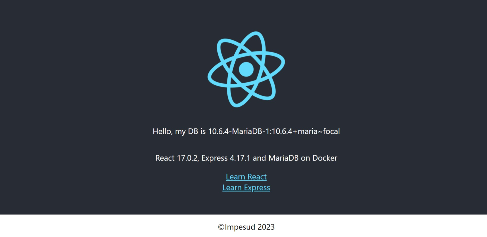
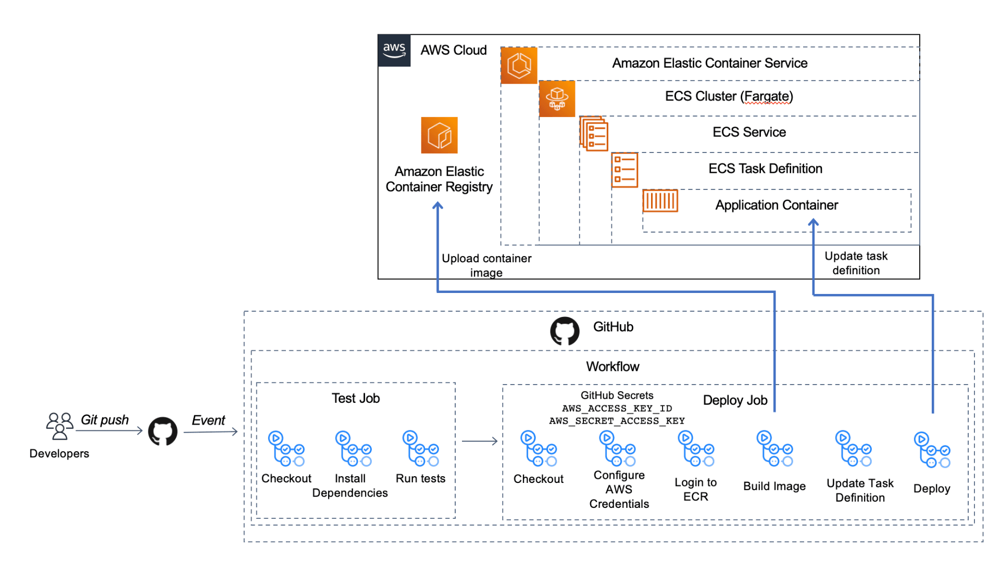

## Compose applications on Docker and AWS

### Use it locally and/or on Docker Dev Environments and deploy on AWS

You can open this sample in the Dev Environments feature of Docker Desktop version 4.12 or later.
[Open in Docker Dev Environments](https://open.docker.com/dashboard/dev-envs?url=https://github.com/Impesud/react-express-mysql/tree/master/react-express-mysql)

This application has been tested up to Docker Desktop version 4.18

### Status


### React application with a NodeJS backend and a MySQL database

Project structure:
```
.
├── .aws
│   └── impesud-revision1.json
├── .docker
│   └── docker-compose.yaml
├── .github
│   └── workflows
│       ├── CD.yml
│       └── CI.yml
├── backend
│   ├── Dockerfile
│   ...
├── db
│   └── password.txt
├── frontend
│   ├── ...
│   └── Dockerfile
|── compose.yaml
└── README.md
```

[_compose.yaml_](compose.yaml)
```
services:
  backend:
    build: backend
    ports:
      - 80:80
      - 9229:9229
      - 9230:9230
    ...
  db:
    # We use a mariadb image which supports both amd64 & arm64 architecture
    image: mariadb:10.6.4-focal
    # If you really want to use MySQL, uncomment the following line
    #image: mysql:8.0.27
    ...
  frontend:
    build: frontend
    ports:
    - 3000:3000
    ...
```
The compose file defines an application with three services `frontend`, `backend` and `db`.
When deploying the application, docker compose maps port 3000 of the frontend service container to port 3000 of the host as specified in the file.
Make sure port 3000 on the host is not already being in use.

> ℹ️ **_INFO_**  
> For compatibility purpose between `AMD64` and `ARM64` architecture, we use a MariaDB as database instead of MySQL.  
> You still can use the MySQL image by uncommenting the following line in the Compose file   
> `#image: mysql:8.0.27`

## Deploy with docker compose

For the first start:
```
$ docker compose up -d
Creating network "react-express-mysql_default" with the default driver
Building backend
Step 1/16 : FROM node:10
 ---> aa6432763c11
...
Successfully tagged react-express-mysql_frontend:latest
WARNING: Image for service frontend was built because it did not already exist. To rebuild this image you must use `docker-compose build` or `docker-compose up --build`.
Creating react-express-mysql_db_1 ... done
Creating react-express-mysql_backend_1 ... done
Creating react-express-mysql_frontend_1 ... done
```
From the second boot onwards:
```
$ docker compose up -d
[+] Running 7/7
✔ Network react-express-mysql_public Created                                                              0.6s
✔ Network react-express-mysql_private        Created                                                              0.6s
✔ Volume "react-express-mysql_back-notused"  Created                                                              0.0s
✔ Volume "react-express-mysql_db-data"       Created                                                              0.0s
✔ Container react-express-mysql-db-1         Started                                                             11.9s
✔ Container react-express-mysql-backend-1    Started                                                             13.5s
✔ Container react-express-mysql-frontend-1   Started
```

## Expected result

Listing containers must show containers running and the port mapping as below:
```
$ docker ps
CONTAINER ID   IMAGE                          COMMAND                  CREATED         STATUS                   PORTS                                                  NAMES
583a96a5470a   react-express-mysql-frontend   "docker-entrypoint.s…"   3 minutes ago   Up 3 minutes             0.0.0.0:3000->3000/tcp                                 react-express-mysql-frontend-1
86ffb77bfd57   react-express-mysql-backend    "docker-entrypoint.s…"   3 minutes ago   Up 3 minutes (healthy)   0.0.0.0:80->80/tcp, 0.0.0.0:9229-9230->9229-9230/tcp   react-express-mysql-backend-1
7bcfca726a86   mariadb:10.6.4-focal           "docker-entrypoint.s…"   3 minutes ago   Up 3 minutes             0.0.0.0:5000->3306/tcp                                 react-express-mysql-db-1
```

After the application starts, navigate to `http://localhost:3000` in your web browser.




The backend service container has the port 80 mapped to 80 on the host.
```
$ curl localhost:80
{"message":"Hello from MySQL 8.0.19"}
```

Stop and remove the containers
```
$ docker compose down
[+] Running 5/5
✔ Container react-express-mysql-frontend-1  Removed                                                               1.0s
✔ Container react-express-mysql-backend-1   Removed                                                               2.5s
✔ Container react-express-mysql-db-1        Removed                                                               0.8s
✔ Network react-express-mysql_public        Removed                                                               0.5s
✔ Network react-express-mysql_private       Removed

```

## Continuous Integration (CI) and Continuous Deployment (CD)

You've built out the first version of your application and even containerized it with Docker so your developer teammates can run it locally. Now, it's time to figure out how to deploy this container into the world! There are two key goals you want to accomplish with your deployment: first, you want your app to stay current, deploying whenever you or your teammates push a new feature up to the repo; second, you want to make sure your code is high-quality and immediately valuable to customers. To deliver on these goals, you'll need to create a CI/CD pipeline to deploy our container to infrastructure in the cloud.

For the CI/CD pipeline, we used GitHub Actions to create a workflow with two jobs. The two jobs below will be triggered when we push code to the main branch of our code repo:

a test job to run unit tests against our application (CI.yml file) and
a deploy job to create a container image and deploy that to our container infrastructure in the cloud (CD.yml file).

Then, in the last step all created images are pushed to a public repository of AWS ECR.

Below is an architecture diagram of what we build:



## Conclusion

A CI/CD Pipeline serves as a way of automating your software applications’ builds, tests, and deployments. It is the backbone of any organization with a DevOps culture. It has numerous benefits for software development and it boosts your business greatly.